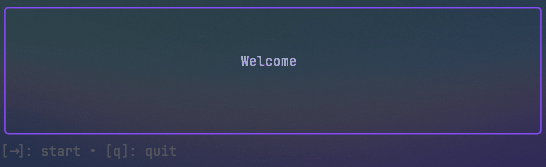

# flashMe



FlashMe is a terminal-based flashcard application written in Go using the Bubble Tea framework. It provides a simple and efficient way to study and review flashcards right from your command line. FlashMe is designed to be easy to use, customizable, and distraction-free.

## Features

- flashMe offers a user-friendly interface where users can navigate through flashcards using keyboard commands.
- Each flashcard displays a question, and users can reveal the answer with a single keystroke.

## Installation

To get FlashMe, make sure you have Go installed on your system, and start by cloning the repo

```bash
git clone https://github.com/burgr033/flashme
cd flashme
go mod tidy
go run main.go
```

## Usage

After installing FlashMe, start the application by running:

```bash
flashme
```

Follow the on-screen instructions to navigate through the flashcards and review your study materials.

## Contributing

As I am new to Go, contributions to FlashMe are very welcome! If you have any ideas, suggestions, or bug fixes, feel free to open an issue or submit a pull request on [GitHub](https://github.com/burgr033/flashme).

## Roadmap

* The next thing I will work on, is the ability to put in data after compilation. As of now you can only insert data by 

## License

FlashMe is licensed under the [MIT License](LICENSE).

## Acknowledgements

FlashMe is built using Bubble Tea, a terminal UI framework for Go by Charmbracelet. Special thanks to the developers and contributors of Bubble Tea for providing such a powerful and versatile framework for building terminal-based applications.
